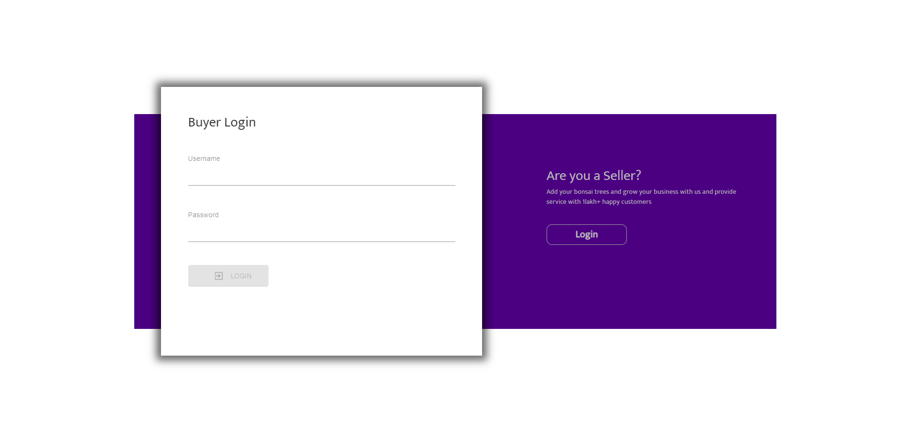

# cloudwiry_frontend_task

<h1>WEBSITE</h1>

# Package Usage

## Quick start

clone the repository
#### Start the server
    git clone 'https://github.com/sanjay-06/cloudwiry_frontend_task'
      
### Website Link
<a href="https://site-linked.herokuapp.com/" target="new">CLICK HERE ITS THE APP LINK</a>

#### Start the server
      pip install requirements.txt
      python server.py

#### Start the client
      cd client
      npm install
      npm start

